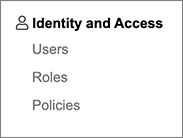

# Systems and Subsystems

Systems and subsystems are what give the TeacherSeat learning platform rich functionality that a user will access across the Student and Admin panel. 

> Think of how AWS or Azure has many cloud services (systems) with specific cloud features (subsystems). 

## What is a System?

A System is a collection of features (subsystems) that logically define a specific service offering based on a business or technical domain.

> The term service and system are interchangable and in some cases we'll use the the word service

Examples of notable systems:
- Identity and Access Management
- Student Management
- Content Management
- Payments Management
- Support Management

eg. The Identity and Access Management system is a core service with the following subsystems: Users, Policies and Roles

## What is a Subsystem?

A subsystem is a feature that resides within a system.

## What is a System plugin?

## Systems Management

### Registering and Deregistering Systems
